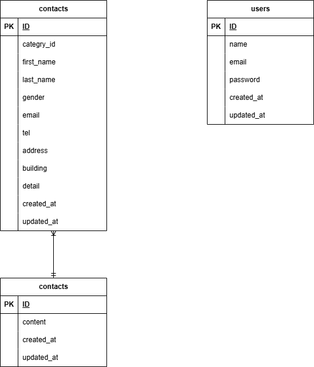

# confirmation_test_contact-form

## Environment / 実行環境
- Virtualization / 仮想化環境:Docker / Docker Compose
- php: 8.1 
- Laravel: 8.83.8
- mysql: 8.0.26
- phpmyadmin
- nginx: 1.21.1

## Setup Instructions / 環境構築
1. Clone the repository / リポジトリクローン  
 ```git clone git@github.com:ruigorou/confirmation_test.git```  
 ```cd confirmation_test```
2. Build and Start Docker Containers / Dockerコンテナのビルドと起動  
```docker-compose up -d --build```
## Laravel Setup / Laravel環境構築
1. Install Laravel Packages / Laravelパッケージのインストール  
 ```docker-compose exec php bash```  
 ```composer install```
2. Create Environment File /　環境変数の作成(.envファイルの作成)  
```cp .env.example .env```
3. .envの設定  
```  
DB_CONNECTION=mysql  
DB_HOST=mysql  
DB_PORT=3306  
DB_DATABASE=laravel_db  
DB_USERNAME=laravel_user  
DB_PASSWORD=laravel_pass  
```
4. Generate Application Key /　アプリケーションキーの生成  
```php artisan key:generate```

## Run Migrations / マイグレーション実行  
```php artisan migrate```  

## Run Seeder / シーディングの実行  
```php artisan db:seed```
### Check that the seeder file was created via phpMyAdmin / phpMyAdminでシーディング結果を確認  
[http://localhost:8080](http://localhost:8080)

## File Structure / ファイル構成
```
confirmation_test_contact-form/
├── README.md
├── docker
│   ├── mysql
│   ├── nginx
│   └── php
├── docker-compose.yml
└── src
    ├── README.md
    ├── app
    ├── artisan
    ├── bootstrap
    ├── composer.json
    ├── composer.lock
    ├── config
    ├── database
    ├── docs
    ├── package.json
    ├── phpunit.xml
    ├── public
    ├── resources
    ├── routes
    ├── server.php
    ├── storage
    ├── tests
    ├── vendor
    └── webpack.mix.js
```
## Application URLs (Development Environment) / url(開発環境)
- Contact Form / お問い合わせ画面：http://localhost
- User Registration / ユーザー登録：http://localhost/register
- phpmyadmin：http://localhost:8080

## ER Diagram / ER図



